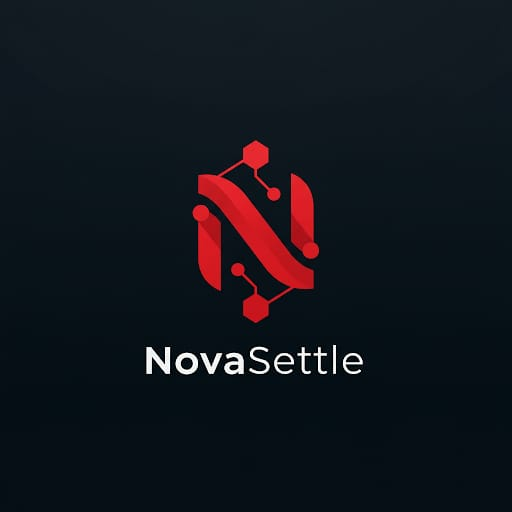

# NovaSettle: Decentralized Leveraged Loan Marketplace

NovaSettle is a cutting-edge decentralized leveraged loan marketplace built on the Solana blockchain that revolutionizes crypto lending through innovative token generation and seamless wallet interactions. The platform empowers users with comprehensive loan discovery, advanced filtering, and intuitive investment mechanisms.



## Features

- **Wallet Integration**: Connect seamlessly with popular Solana wallets (Phantom, Solflare, Backpack)
- **KYC Verification**: Complete identity verification to participate in the loan marketplace
- **Create Loans**: List your own loan offerings with customizable terms and collateral requirements
- **Invest in Loans**: Browse available loans with detailed insights and purchase loan tokens
- **Real Token Creation**: Generate actual SPL tokens on Solana Devnet that are linked to your wallet
- **Comprehensive Dashboard**: Monitor your investments, created loans, and overall portfolio performance
- **Rich Filtering**: Sort and filter the marketplace by APR, loan term, and token types

## Technology Stack

- **Frontend**: React, TypeScript, Tailwind CSS, shadcn/ui
- **Blockchain**: Solana Web3.js, SPL Token Program
- **Authentication**: Wallet-based authentication
- **State Management**: React Context API, TanStack Query
- **Backend**: Express.js server with in-memory storage

## Prerequisites

- Node.js (v16 or higher)
- NPM or Yarn package manager
- A Solana wallet (Phantom, Solflare, or Backpack)
- Solana Devnet SOL tokens for testing (available via faucets)

## Setup Instructions

1. **Clone the repository**

```bash
git clone https://github.com/yourusername/novasettle.git
cd novasettle
```

2. **Install dependencies**

```bash
npm install
```

3. **Start the development server**

```bash
npm run dev
```

This will start both the frontend and backend servers concurrently. The application will be available at `http://localhost:5000`.

## Usage Guide

1. **Connect Wallet**
   - Click on "Connect Wallet" in the navigation bar
   - Select your preferred Solana wallet (Phantom, Solflare, or Backpack)
   - Approve the connection request in your wallet

2. **Complete KYC Verification**
   - Navigate to the KYC button in the header
   - Follow the verification steps to enable full platform functionality

3. **Creating a Loan**
   - Go to "My Loans" page
   - Click "Create New Loan"
   - Fill in loan details (amount, collateral, APR, term)
   - Submit and approve the transaction in your wallet

4. **Investing in Loans**
   - Browse the marketplace for available loans
   - Use filters to find suitable investments
   - Click "Buy Loan Token" on any loan card
   - Approve the transaction in your wallet

5. **Managing Your Portfolio**
   - Track your investments in the "Investments" page
   - Monitor your created loans in the "My Loans" page
   - View overall statistics in the "Dashboard"

## Development Notes

- The application uses Solana's Devnet for all blockchain interactions
- Wallet addresses are used as unique identifiers for users
- KYC verification is simulated for demonstration purposes
- Token creation uses deterministic addresses linked to creator wallet

## License

[MIT License](LICENSE)